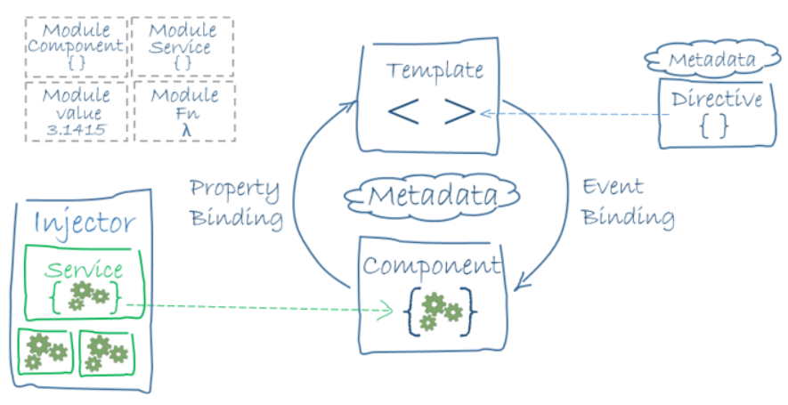

# Introducion to Angular Concepts

* Angular: platform and framework
    * used to build single page applications (SPAs)
    * Main building blocks of Angular is **NgModules**

### Framewok
* A framework is a collection of programs that help you write and use a language more efficently. Angular is a TS framework
* TypeScript is just ES6 with Types


## NgModules
* these provide a complilation context for *components*
* Collect related code into funtional sets
* an Angular app is *defined* by it's NgModules.
* Alwaus has a root modulr thet enables bootstrapping
     * typically had more *feature modules*
* **components** define **views**
* **components** use **services** 
    * provide specific functionality not directly related to view.
    * service providers can be injected as dependancies
        * makes code modular, reusable and efficient

* components and services are **simply classes** with decorators (marking their type & providing metadata).
    * metadata for a compont class associates it with a template that defines a view
    * a template is just ordinary HTML with angular directives and binding markup that allows angular to modfy the HTML before it is rendered.
* The Router Service (or just the router) helps define sophisticated navigation capabilities.

## Modules
- differ from and compliment JS modules
- root module for Angular app is **AppModule**
    - provides bootstrap module that launches the application
- Angular app contains many functional modules
- Same as JS modules, Angular modules inherit functionality from other modules.
    - e.g. to use Router, import RouterModule
- Modules allow Lazy Loading which allows better performance and minimisation of inital page load.
- *reduces high bounce rates*

## Components 
- Angular app has at least 1
    - root component
    - connects component hierarchy with DOM (document object model)
- components define classes 
    - contain logic, and associated HTML template that defines view for display in target environment.
- @Component defines class as component & provides template & related, specific metadata
- **Decorators** are functions that modify JS angular defines decorators that attach specific metadata to classes so the system knows how it should work.

## Templates, Directives & Data Binding
- template combines
    - HTML
    - Angular Markup
- Template Directives 
    - program logic & binding markup
    - Two types of **Data Binding:**
        - *Event Binding* - lets app respond to user data by updating the application data
        - *Property Binding* - lets you interpolate computed values into the HTML
#### Before a view is defined, angular evaluates the directives and resolves the binding syntax, in the template to modify the HTML elements and DOM according to the program data and logic. 
#### Angular supports *two-way* data binding meaning changes in the DOM are also reflected in your program data.
- Templates use *pipes* to transform data for display.

## Services & Dependency injection
- Services allow logic/data thats not specific to one class to be defined and used across components
    - via a service class
        - service classes preceeded by @Injectable() decorator
        - this decorator provides metadata that allows it to be injected as a dependancy to other classes.
    - Dependancy injection (DI) allows component classes to be kept clean and efficent.
    - Compont classes dont have to fetch server data, valadate user input or log into the console - these can be delegated to a service.

## Routing
- Router NgModule allows navigation amnth application states and view hierarchies
- Router maps URL like paths to views, instead of pages.
- When user clicks a link, the router intercepts the behavior and shows/hides view hierarchies.
- to define navigation rules - you associate navigate paths with componets.

- component & template define angular view 
    - decorator on a componet adds *metadata*, including a pointer to the associated template
    - Directives & binding markup in component template - modify views based on the data and the logic defined.
- DI provides services to a componet, such as router service that lets you define navigation amongst views.

## Tour of HEROS
- aquires and displays data
- create angular components
- use one way data binding ( read only data )
- editable fields - 2 way binding
- bind component methods to services, keystrokes, clicks
- enable selection from a list then display in view
- create shared service
- use routing

## Angular pipes
### Angular has many inbuilt pipes ready for use out of the box, they come with the framework:
- Pipes Provided by Angular
    - CurrencyPipe
    - DatePipe
    - DecimalPipe
    - JsonPipe
    - LowerCasePipe
    - UpperCasePipe
    - PercentPipe
    - SlicePipe
    - AsyncPipe 
### Currency pipe
```js
{{ 1234.56 | currency:'CAD' }}
``` 
#### prints out: CA$1,234.56
- if we instead want the symbol, add another parameter: **symbol-narrow**
```js
{{ 1234.56 |currency:"CAD":"symbol-narrow" }}
``` 
#### prints out: $1,234.56
### You can also create your own Angular Pipes


    


