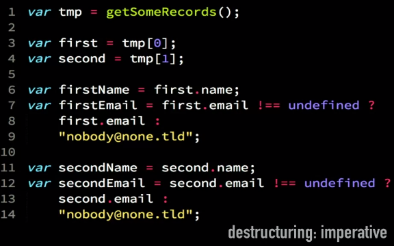
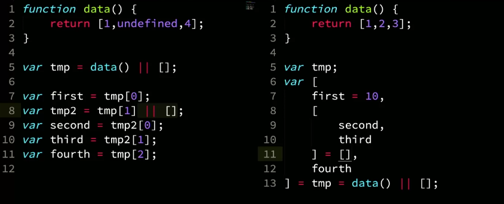

# JavaScript: The Hard Parts
By Leanne | Frontend Masters

- to view  Open Preview (Ctrl+Shift+V) 

## Thread of Exceution in JS

- the thread of execution in JS first goes through the code, line by line.
- Can only store values as the thread goes through. 
- When the thread of execution comes to a function call, it stores the name but remains unitalised.
- - this can be seen by the parenthesis ( ). 

### Execution Context
- is ran when we have to then run the functions, after the definitions have been set up (1,2,3). Then we start a new execution context to runthese functions with their own **thread of execution** and **memory** (4). 
- when results are returned by these functions, they evaluate to the answer/result. It literally replaces the information held there before.


## Promises - ES6

**Promises do 2 things:**
1. initiate background web browser work - BROWSR
2. Return a placeholder object (promise) - JS
    - containing the value that is returned
    - containing an  onFullfilled [] array ~ this is a hidden property
    - once the value is returned from the fetch request, whatever functions are stored in the onFulfilled array are ran. The value recievied  is passed in as a parameter to the functions in onFullfilled.
    - .then tells the fetch what to do when the data is returned.
    **cannot see the onFulfilled hidden property in the console**

### Fetch

```js
const futureData = fetch('https://twitter.com/will/tweets/1');
futureData.then(display);

function display(data){
    console.log(data);
}
```
— fetch is very powerful
- it returns a promise containing a value and onFullfilled array.
- it also sends a network request via the web browser
    - network request contains the:
        1.  domain name and i.e. www.twitter.com
        2. the path i.e. /will/images/1
- fetch defaults to a GET request, we can pass parameters for it to be a POST  etc.


### Then 
#### method and functionality
- any code we want to run on when the data is returned , must also be saved on the promise object.
- it's added using the **.then** method to access the hidden property onFulfillment
- promise objects automatically trigger attached function to be run in onFullfilled. The input to this function is the returned data.

## Asynchronous 
- means runining the code not in the order it was said to be done

## There are 2 queues in JS
- if you check the documentation you can tell what type of queue the function will be placed into.
- 2 pronged promise object
 - - any function that is attached to a promise object by a 2 pronged fasade function and the result is accessed via .then, they all go into the **microtask Q**

- any function that is passed into a facade function that passed in directly to a fasade feature that triggers outside work from web browser features, when the background task is complete, these are put into the **callback Q**

#### Callback Q
- Any function that is thrown out of JS or a link back to it via the Web Browser Facade Funtions, like setTimeout (timer), go into the callback queue.

#### Microtask Q
- Any function that is attached to a promise object via the **.then** method and then auto triggered to run by JS when the 'value' property is returned 
- Those fuctions go on the micro-task queue

#### once global execution is done, the event loop checks the microtask queue first then it checks the callback Q

#### fasade funtions / APIs

### Promises, Web APIs, the Callback & microtask Queues and the Event Loop enable:
- **Non-blocking applications:** don't have to wait for the single thread to finish
- **However long it takes:** We cant prdict how long the browser will take so we let JS control automatically running functions after completion.
- **Web Applications:** Async JS is the backbone of modern web = allows us to build fast non-blocking applications. 

## Objects
### Object dot notation
- if were passing around an object i.e. user 1 and we want to increment a score for this user.. it would be handy if the functions in relation to this user were attached to the user object. This way its easy to call, say incrementScore on user 1 very easily.
- this way its accesable to the user 1 also & specifically. It won't be used by some random thing.
- This can be done with object encapsulation
- - have the data
- - and its functionality coupled. 

#### Example
- here we can add the user 2 with dot notation
- line 4: this is a **method**, as it's a function on an object.


- **object.create** is a built in function in JS that gives us fine control over the object
- all it does is create an empty object
- - with hidden properties, no direct properties
- Object orientated programming has the object and all functionality attached to it all easily accessable.
- Functional programming is on the rise but its very important to really understand how OOP works as it's so powerful and intuitive once you understand it.
- if you keep using a function again and again, it should be generalised allowing the parameters to be the variables and only they change on input.
- Generate a reusable function for this instead


## Classes and Prototypes

### Prototype Chain & Prototypical Link
- the indelable link/prototype link/hidden link to the function 
- what function is linked depends on what function was passed in as a param
```js
const newUser = Object.create(userFunctionScore);
```
- is made when we use the **Object.create** method
- Object.create: creates an empty object WITH  a hidden property __ proto__
- link to one single object that can be used by many others, via the link. This is a **feature of javascript** 
- if we set something to be linked to something else, it will be, though its proto property.
- the argument passed into Object.create is always stored in the proto

**can see the proto hidden property in the console and the place its linked to**

### .this
- if we run a method use .this, when the new execution context is made, immediately, this is stored in it's local memory, and whatever called the method, will be passed.
#### key use of the this keyword
- runa function that is going to be available to many differnt objects, through the proto link and make sure we use the keyword **.this** to access the object on which the function is being executed, to the right hand side of the dot..
```js
user1.increment();
```
## Object - Proto Property
- all objects in js have a proto property.
- The Object.prototype
- - Object.prototype has the hasOwnProperty attached

### hasOwnProperty
- we can use hasOwnProperty method, if user1 calls this, its found by linking to a larger object, not on the user1 object.
- all objects have a __ proto __ property by default which links to a big object - Object.prototype full of useful functions
- we get access to it via userFunctionStore's __ proto __ property up the chain.

- if you run a subfunction, within the initial function using the this. The this is lost and instead goes to global memort to find a this that isn't there.
- Fixes for this used to be, to equal this = that. Then in the second function use the that. Not the this which has lost its context
- We can now overcome this in a better way, using .call / .bind or an arrow function for the second function call instead.
- When an arrow function is used, it carries over the global context of the function call with it too so the .this context is also passed.
**it makes a lexically scoped this. Using an arrow function**
- therefore we don't want to use arrow functions for our methods on objects, or top level function calls as there is no inner scope, it therefore does to the global scope and doesnt hold the right value for .this. 
``` 
see video Arrow Functions, Scope and this in Classes and Prototypes for a great understanding and code examples
```

### Object.create
- interview
- I prefer using Object.create for more fine control over object creation

### Solution 2: The Prototype Chain


### Solution 3: Keyword New


### Solution 3: Keyword New


-- some notes missing from cours end 

# JavaScript - The Recent Parts

## Ch1 - Intro

### Transpilers
- very common one is babal
- give it your current code and it will make a backwards compatible version for older browsers.

## Ch2 - Template strings
- Kyle Sympson calls these Interpolated Literals or Intpoliterals
- Template strings course questions next

## Ch 3 - Destructuring
- idea behind destructuring is to break up something large into smaller parts assigning each of these smaller parts (if we so wish), to individual variables / properties etc.

### Example where destructuring is useful
- when retriving from an API and it sends back a big complex JSON object, this is how we can sometimes get back a big nested object where we might only want a few of the properties
- we might retrieve them like below:



### Solved with Destructuring
- because it's on the lhs of the equals... its a pattern, a pattern to describe what we expect back.
- So we can assign it to something
- The equals is a fallback if it's not there
- can leave entries blank if you don't want to assign them.
- the pattern can match only the bits you want, it does't have to match the returned data in its entirety... just the bits/properties you want.
- the code in its declaritve nature is self documenting as we can see exactly what it is we are expecting back from the api.


- ... can be used as the final expected value and it says, collect the rest of the values, whatever is left, in an array.
- when we destructure, were taking the smaller bits and assigning them to some other things. We then throw away the larger item keeping just the bits we need.
- If however we may need the larger item again,we may also assign the whole item to something when destructuring using a double equals.
**RIGHT IS ALWAYS DESTRUCTURING APPROACH IN IMAGES**


- if you want to leave something undeclared, if you didnt want to capture it
- you just leave an empty position inbetween the commas
- this is called array illusion 


### Can also use destucturing to swap items in an array


- say we have data which recives an array tmp
- in destructuring we can do the destructuring directly from a parameter position.

### null
#### if null is returned, and we then try to take data from null, we would get a type error
- the same is true if we were to try and do this during destructuring.
- **we would get a typeerror if we tried to access a null value**
- in order to fix this, we'd have a fallback or empty array. **|| []**
- we do this the exact same in destructuring.


- we can also do this for individual parameters
- Providing a Default Value for Parameters When Destructuring


#### We also have destructuring for nested arrays




- in destructuring the layout is
**source, target, default**
- i.e. b (source), second (target), 42 (default value)


## Destructuring and Restructuring an API Call
- we can quicly and easily call out defaults, such as url and method here. 


# Array. Find and Array.include

-Tells us truthy or falsy if it exists in the array


### Flat Map


-COME BACK TO VIDEO FLAT & FLATMAP
## iTERATORS AND gENERATORS


- for of loop takes iterables allowing you to iterate thorough them


### Object Iteration


- Objects throw a type error if iteration is attempted on them

**makingOurOwnObjIterator**
- making our own iterator for objects
- here we use the this keyword, we use it because we want to use the this keyword inside the function, but we also want it to lexically adopt the parent context


## Generators
- Generators are a new type of funcdtion call in ES6
- When you invoke them, they dont run, they **produce an iterater***
- scene as it's a standard iterator, it has a .next property.
- yeild allows the iterator to produce different values each time its iterated over.
- if you make your own iterator, notice how the array returned is missing the final value.
- as soon as it sees done = true it stops, effectively throwing away the value 4


## Star -Generate
- Line 5 the star indicates the function is going to be the generator type
- its a concise method with no inputs
- yeild this[key] ~ gives out the value
